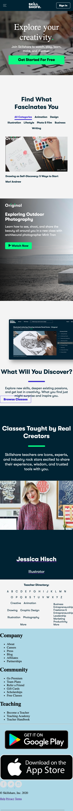

# Procesverslag

**Auteur:** Karlijn Nijland

## Bronnenlijst

Mijn [Codepen](https://codepen.io/Karlijn12345/pen/oNxdaEP)

1. https://www.squarespace.com
2. https://www.skillshare.com/
3.

## Eindgesprek (week 7/8)

-dit ging goed & dit was lastig-

**Screenshot(s):**

-screenshot(s) van je eindresultaat-

## Voortgang 3 (week 6)

-same as voortgang 1-

## Voortgang 2 (week 5)

### Stand van zaken

De afgelopen twee weken ben ik bezig geweest met het opzetten van een tweede HTML pagina en het stijlen van de eerste HTML pagina. Dit gaat al aardig goed. Hier en daar zijn er wat dingetjes die ik lastig vind, maar Google en vragen stellen helpen enorm. De volgende grote uitdaging wordt om een carousel te gaan maken met JavaScript. Gelukkig zijn er ook boordevol tutorials hierover op Youtube te vinden.

### Agenda voor meeting

Ik ga een aantal vragen aan de student assitent vragen. Vooral over wat de beste manier is hoe ik mijn tweede HTML pagina kan stijlen aangezien ik voor mijn eerste HTML pagina alle elementen heb aan geshreven met first-of-type, nth-of-type, etc. en hierdoor de stijling ook wordt overgenomen door de HTML elementen op de tweede HTML pagina.

Daarnaast zijn er een aantal simpele dingetjes waar ik tegen aan loop. Zoals een knop die niet doet wat ik wil en een afbeelding die ik niet goed geplaatst krijg, etc.

**Screenshot(s):**

## Voortgang 1 (week 3)

### Stand van zaken

Ik had al een tijdje niet meer gecodeerd, dus HTML oppakken was in het begin weer even wennen. Een aantal dingen waren al een beetje bij mij weggezakt. De content in HTML schrijven was nog te doen. Hier en daar zullen er werkende wijs nog classes toegevoegd moeten worden en eventuele containers. De echte uitdaging zit hem straks in het alles netjes opmaken in CSS.

**Screenshot(s):**

### Agenda voor meeting

De meeting hebben wij een uur voor het voortgangsgesprek. We hadden een erge drukke week, op donderdag hadden wij zelfs les van 9:20 tot 18:40, waardoor we niet eerder tijd hadden om af te spreken. Wanneer we een agenda hebben gemaakt, zal ik die hier plaatsen.

Mijn vraag(en):

- Hoe positioneer ik een afbeelding in een hero in zo'n geval dat de hoeken niet uitlijnen met de container maar er verder buiten vallen, van het scherm af?

### Verslag van meeting

-na afloop snel uitkomsten vastleggen-

## Intake (week 1)

**Je startniveau:** Mijn startniveau zit tussen de blauwe en rode piste in, maar wel iets meer neigend naar de rode piste. Ik vind coderen lastig, daarentegen ben ik wel iemand die van dingen onderzoeken/uitzoeken houdt. Vaak kom ik met behulp van Google of door hulp van iemand er wel uit. Waar ik op dit moment vooral tegenaan loop bij CSS is flexbox en responsive design. Ik heb nog niet helemaal door hoe je op de juiste manier dit netjes moet gebruiken. Het is dus voor mij een goed leerdoel om flexbox en responsive design onder de knie te krijgen bij dit vak om mijn vaardigheden in CSS verder te ontwikkelen. Daarnaast zitten mijn JavaScript vaardigheden wel nog echt op de blauwe piste. Dit weerhoudt mij er niet van om deze op te hogen naar de rode piste dit vak. Gelukkig begin ik steeds meer de logica van JavaScript in te zien! Ten slotte begrijp ik HTML over het algemeen wel. De valkuilen zitten bij mij vooral nog in CSS en JS.

**Je focus:** Mijn focus zal gaan liggen op de responsive design van mijn website, omdat dit iets is wat ik nog niet onder de knie heb en graag zou willen leren. Ik wil mij namelijk focussen op het beter worden in goed en toegankelijk coderen. Als ik een extra uitdaging nodig blijk te hebben, dan kan ik er nog voor kiezen om ook nog aandacht te geven aan de surface laag, maar dit hangt echt af van hoe snel of niet snel ik leer mijn website responsive te maken. Als ik merk dat ik vastloop met responsive design, zelfs na hulp te hebben gevraagd, dan zal ik mijn focus verplaatsen naar de surface laag.

**Je opdracht:** Ik zal voor deze opdracht de website van [Squarespace](https://www.squarespace.com) gaan namaken. Dit voelt voor mij als een uitdaging waar ik het meest van kan leren. Ik zal beginnen met de website statisch te coderen voor mobile device en ten slotte, als ik tijd over heb, zal ik micro-interacties met JavaScipt gaan toepassen.

Ik heb er toch uiteindelijk voor gekozen om de website van [Skillshare](https://www.skillshare.com/) te gebruiken voor deze opdracht. Tijdens het coderen kwam ik er toch achter dat de website van Squarespace net een te grote uitdaging is voor mij. Ik zie meer potentie in de website van Skillshare. Wel lijkt het me een leuke uitdaging om alsnog de website van Squarespace ooit ergens in mijn vrije tijd te gaan coderen, als mijn vaardigheden wat verder ontwikkelt zijn. Omdat ik wat laat heb geswitched van website, heb ik helaas nog niet zoveel kunnen coderen als ik had gewild.

**Screenshot(s):**
Mobiele website Squarespace screenshots:

Desktop website Squarespace screenshots:

Mobiele website Squarespace screenshots:

Desktop website Squarespace screenshots:

**Breakdown-schets(en):**

###Breakdownschets van de mobiele home pagina van Squarespace:###

###Breakdownschets van de mobiele home pagina van Skillshare:###

